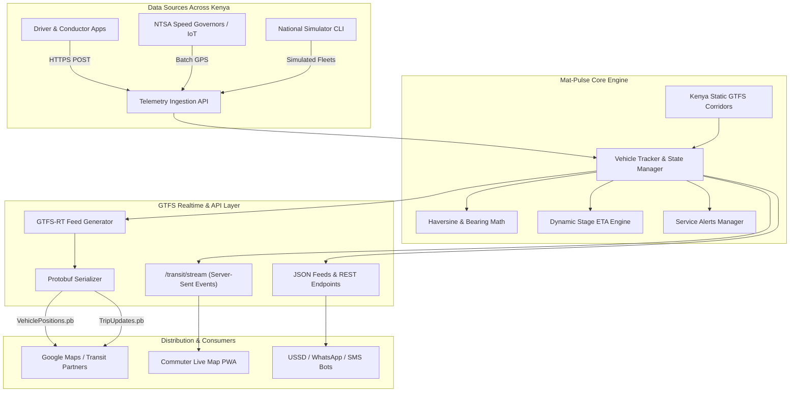

# 🚐 Mat-Pulse (Kenya Real-Time Public Transit & GTFS Engine)

[](https://swahilipothub.co.ke)
[](https://nodejs.org)
[](https://www.typescriptlang.org)
[](https://gtfs.org/realtime/)
[](https://github.com/Swahilipot-Hub-Engineering/mat-pulse)
[](LICENSE)
[](CONTRIBUTING.md)

**Mat-Pulse** is an open-source real-time transit telemetry engine and **GTFS / GTFS-Realtime (GTFS-RT)** provider designed for the informal public transit (matatu, bus, and shuttle) ecosystem across **Kenya** (Nairobi Metropolitan, Mombasa & Coast, Kisumu & Lake Region, Nakuru & Rift Valley, and Inter-County Corridors).

Developed at **[Swahilipot Hub Foundation](https://swahilipothub.co.ke)** by the engineering community, Mat-Pulse bridges the gap between chaotic on-the-ground matatu operations and modern commuter navigation tools like **Google Maps, Apple Maps, OpenTripPlanner, and local commuter apps**.

---

## 🎯 The Problem in Kenyan Public Transportation

Over 70% of urban and peri-urban Kenyans depend on matatus and buses every day for commuting to work, school, and markets. However:

* **Zero ETA Visibility:** Commuters wait at stages without knowing if a matatu is 2 minutes or 40 minutes away.
* **Demand-Driven / Informal Dispatching:** Matatus depart when full rather than adhering to rigid timetables, rendering static timetables inaccurate.
* **Fare Fluctuations & Traffic Blindspots:** Heavy congestion along major arteries (e.g. Thika Superhighway, Mombasa Road, Lang'ata Road, Nyali Bridge) creates unpredictable travel times.
* **Digital Exclusion from Global Transit Maps:** Global platforms such as **Google Maps Transit** have minimal real-time public transit coverage in Kenya due to the lack of standardized, open GTFS and GTFS-RT telemetry streams.

---

## 💡 What Mat-Pulse Does

Mat-Pulse transforms raw GPS telemetry from driver smartphones, NTSA-certified speed governors, and IoT telematics hardware into standardized, open transit data:

1. **Nationwide Telemetry Ingestion API:** High-throughput REST and batch endpoints ingesting live vehicle GPS coordinates, speed, and heading across all 47 counties.
2. **Dynamic Stage ETA Engine:** Map-matches vehicles against designated transit corridors to calculate realistic stage countdowns.
3. **GTFS-Realtime (GTFS-RT) Feeds:** Automatically compiles and serves standard Protocol Buffer (`.pb`) and JSON mirrors:
   * `VehiclePositions.pb` (Live coordinates, bearing, speed in m/s)
   * `TripUpdates.pb` (Stop-by-stop ETA predictions and dwell delays)
   * `Alerts.pb` (Traffic snarl-ups, ferry delays, police checks, weather advisories)
4. **Multi-Region Static GTFS Generator:** Generates compliant static transit schedules (`routes.txt`, `stops.txt`, `trips.txt`, `agency.txt`) filtered nationally or by city.
5. **Interactive Commuter Web Dashboard:** A responsive, mobile-friendly Leaflet map featuring real-time vehicle pins, corridor overlays, and instant region filtering.
6. **National Telemetry Simulator:** Built-in runner generating realistic matatu trips across Nairobi, Mombasa, Kisumu, and Nakuru for local testing without physical hardware.

---

## 🏗️ System Architecture



---

## 🗺️ Supported Regions & Corridors

Mat-Pulse is architected for nationwide multi-region scaling:

| Region | Sample Corridors | Key Stages | Typical SACCOs / Operators |
| :--- | :--- | :--- | :--- |
| **Nairobi Metropolitan** | **Route 125/126:** Rongai – CBD<br/>**Route 45:** Githurai – CBD<br/>**Route 23:** Kangemi – CBD | Rongai → Galleria → Nyayo → Railways CBD<br/>Githurai → Roysambu → Ngara → Odeon CBD<br/>Kangemi → Westlands → Koja CBD | Ongata Line, Super Metro, Githurai 45, Kanyoki |
| **Mombasa & Coast** | **Bamburi – Posta**<br/>**Likoni Ferry – Posta**<br/>**Changamwe – Posta** | Bamburi → Lights → Nyali Bridge → Posta<br/>Likoni South → Ferry Ramp → Posta Digo Rd<br/>Changamwe → Makupa Causeway → Posta | Bamburi Matatu SACCO, Likoni Transit, Changamwe Exp |
| **Kisumu & Lake Region** | **Kondele – CBD** | Kondele → Patel Flats → Mega Plaza → Bus Park | Lake Transit SACCO |
| **Nakuru & Rift Valley** | **Pipeline – CBD** | Pipeline → Free Area → Kanu St → Main Stage | Rift Valley Transit |

---

## 🚀 Quick Start

### Prerequisites
* **Node.js 20+** (`node -v`)
* **npm** (`npm -v`)
* **Git**

### 1. Clone & Install

```bash
git clone https://github.com/Swahilipot-Hub-Engineering/mat-pulse.git
cd mat-pulse
npm install
```

### 2. Configure Environment

```bash
cp .env.example .env
```

### 3. Start the Development Server

```bash
npm run dev
```

Open your browser at **[http://localhost:3000](http://localhost:3000)** to view the live Kenyan transit map dashboard!

### 4. Run the National Matatu Simulator

In a separate terminal, launch the simulator:

```bash
npm run simulate
```

You will see simulated vehicles moving in real time across Nairobi, Mombasa, Kisumu, and Nakuru!

---

## 🐳 Docker Deployment

Run with Docker Compose:

```bash
docker compose up --build -d
```

Verify service health:
```bash
curl http://localhost:3000/api/v1/health
```

---

## 📡 API Reference

### 1. Telemetry Ingestion

#### `POST /api/v1/telemetry`
Ingests a single vehicle position from a matatu crew device or GPS tracker.

```json
{
  "vehicleId": "kdd-555a",
  "routeId": "route-nrb-rongai-cbd",
  "latitude": -1.3486,
  "longitude": 36.7645,
  "speedKmh": 45,
  "occupancyStatus": "MANY_SEATS_AVAILABLE"
}
```

#### `POST /api/v1/telemetry/batch`
Batch ingest for telematics providers and hardware speed governor gateways.

---

### 2. GTFS-Realtime Feeds (Google Transit Partner Compatible)

You can query feeds nationally or filter by region using `?region=<nairobi|mombasa|kisumu|nakuru>`.

| Endpoint | Format | Content-Type | Purpose |
| :--- | :--- | :--- | :--- |
| `/api/v1/gtfs-rt/vehicle-positions.pb` | Protocol Buffer | `application/x-protobuf` | Live matatu GPS coordinates & bearings |
| `/api/v1/gtfs-rt/vehicle-positions.json` | JSON | `application/json` | Developer inspection mirror |
| `/api/v1/gtfs-rt/trip-updates.pb` | Protocol Buffer | `application/x-protobuf` | Stop-by-stop ETA predictions & delays |
| `/api/v1/gtfs-rt/trip-updates.json` | JSON | `application/json` | Developer inspection mirror |
| `/api/v1/gtfs-rt/alerts.pb` | Protocol Buffer | `application/x-protobuf` | Service advisories (ferry, traffic, rain) |

---

### 3. Transit & Regional Static Data

* `GET /api/v1/transit/regions` - List of supported Kenyan transit regions and center coordinates.
* `GET /api/v1/transit/routes[?region=nairobi]` - Catalog of transit routes and stop sequences.
* `GET /api/v1/transit/stops[?region=mombasa]` - Transit stages with GPS coordinates.
* `GET /api/v1/transit/vehicles[?region=nairobi]` - Currently active vehicles with real-time ETAs.
* `GET /api/v1/transit/gtfs-static[?region=all]` - Static GTFS bundle components (`agency.txt`, `routes.txt`, `stops.txt`, `trips.txt`).
* `GET /api/v1/transit/stream[?region=all]` - SSE stream delivering real-time vehicle updates.

---

## 🌍 Google Maps & Transit Integration

To integrate Mat-Pulse with **Google Maps**:

1. **Static GTFS:** Export static feed files via `/api/v1/transit/gtfs-static` and validate using the [Canonical GTFS Schedule Validator](https://gtfs-validator.mobilitydata.org/).
2. **Partner Application:** Apply through the [Google Transit Partner Program](https://maps.google.com/help/maps/transit/partners/).
3. **Feed Endpoints:** Submit your public GTFS-RT URLs:
   * Vehicle Positions: `https://your-domain/api/v1/gtfs-rt/vehicle-positions.pb`
   * Trip Updates: `https://your-domain/api/v1/gtfs-rt/trip-updates.pb`

---

## 🧪 Testing & Validation

Run the automated test suite:

```bash
# Run all unit and integration tests
npm test

# Typecheck TypeScript
npm run typecheck

# Build production bundle
npm run build
```

---

## 🤝 Contributing

We warmly welcome contributions from developers, transit operators, SACCOs, and mapping enthusiasts across Kenya!

* Read [CONTRIBUTING.md](CONTRIBUTING.md) for our pull request process and branching strategy (`feat/*` → `staging` → `main`).
* Read [docs/ONBOARDING.md](docs/ONBOARDING.md) for your first hour walkthrough.
* Read [AGENTS.md](AGENTS.md) if working with AI coding agents.
* Check out [Good First Issues](https://github.com/Swahilipot-Hub-Engineering/mat-pulse/issues?q=is%3Aissue+is%3Aopen+label%3A%22good+first+issue%22).

---

## 👥 Maintainers

| Role | Person | Focus |
| :--- | :--- | :--- |
| **Maintainer** | [@jkose002](https://github.com/jkose002) | Core Architecture, Releases, API Standards |
| **Mentors** | [@Swahilipot-Hub-Engineering/mentors](https://github.com/orgs/Swahilipot-Hub-Engineering/teams/mentors) | Community Onboarding & Good First Issues |

---

## 📄 License

This project is open-source under the [MIT License](LICENSE).
Built with ❤️ by the **Swahilipot Hub Engineering Community** in Mombasa, Kenya.
