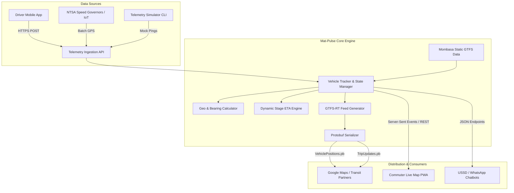

# 🚐 Mat-Pulse (Mombasa Real-Time Matatu Transit Engine)

[](https://swahilipothub.co.ke)
[](https://nodejs.org)
[](https://www.typescriptlang.org)
[](https://gtfs.org/realtime/)
[](LICENSE)
[](CONTRIBUTING.md)

**Mat-Pulse** is an open-source real-time transit telemetry engine and **GTFS / GTFS-Realtime (GTFS-RT)** provider designed for the informal public transit (matatu) ecosystem in **Mombasa and Coastal Kenya**.

Developed at **[Swahilipot Hub Foundation](https://swahilipothub.co.ke)** by the engineering community, Mat-Pulse bridges the gap between chaotic on-the-ground matatu operations and modern commuter navigation tools like **Google Maps, Apple Maps, and local commuter apps**.

---

## 🎯 The Problem

Every day, hundreds of thousands of commuters across Mombasa rely on matatus along key corridors like **Bamburi–Posta**, **Likoni Ferry–Digo Road**, and **Changamwe–Posta**. However:

* **Zero ETA Visibility:** Commuters wait at stages without knowing if a matatu is 2 minutes or 30 minutes away.
* **Informal Dispatching:** Matatus depart when full rather than following rigid timetables.
* **Digital Exclusion:** Major global transit platforms (such as Google Maps Transit) lack live matatu feeds in coastal Kenya due to a lack of standardized GTFS and GTFS-RT data feeds.

---

## 💡 What Mat-Pulse Does

Mat-Pulse transforms raw GPS telemetry from driver smartphones, NTSA-mandated speed governors, and IoT trackers into standardized, open transit feeds:

1. **Telemetry Ingestion API:** High-throughput endpoint ingesting live vehicle GPS coordinates, speed, and heading.
2. **Dynamic Stage ETA Engine:** Map-matches matatu positions along Mombasa transit corridors to calculate realistic stage countdowns.
3. **GTFS-Realtime (GTFS-RT) Feeds:** Automatically compiles and serves standard Protocol Buffer (`.pb`) and JSON feeds:
   * `VehiclePositions.pb` (Live GPS, bearing, speed)
   * `TripUpdates.pb` (Stage ETAs and delays)
   * `Alerts.pb` (Traffic jams, ferry delays, weather advisories)
4. **Static GTFS Data Generator:** Generates compliant static transit schedules (`routes.txt`, `stops.txt`, `trips.txt`, `agency.txt`).
5. **Live Commuter Web Dashboard:** A mobile-friendly interactive Leaflet map optimized for low-bandwidth 3G connections.
6. **Telemetry Simulator:** Built-in runner generating realistic matatu trips across Mombasa for local testing without physical hardware.

---

## 🏗️ System Architecture



---

## 🗺️ Initial Mombasa Corridors

| Route ID | Corridor | Key Stages | Sacco / Operator |
| :--- | :--- | :--- | :--- |
| `route-bamburi-posta` | **Bamburi – Posta** | Bamburi Stage → Lights → Links Rd → Nyali Cinemax → Nyali Bridge → Buxton → Saba Saba → Mackinnon → Posta | Bamburi Matatu SACCO |
| `route-likoni-posta` | **Likoni – Posta** | Likoni South Ramp → Likoni Ferry Island → Treasury Square → Posta → Mackinnon → Buxton | Likoni Transit SACCO |
| `route-changamwe-posta` | **Changamwe – Posta** | Changamwe Roundabout → Magongo → Kibarani → Makupa Causeway → Saba Saba → Posta | Changamwe Express |

---

## 🚀 Quick Start

### Prerequisites
* **Node.js 20+** (`node -v`)
* **npm** (`npm -v`)
* **Git**

### 1. Clone & Install

```bash
git clone https://github.com/Swahilipot-Hub-Engineering/mat-pulse.git
cd mat-pulse
npm install
```

### 2. Configure Environment

```bash
cp .env.example .env
```

### 3. Start the Development Server

```bash
npm run dev
```

Open your browser at **[http://localhost:3000](http://localhost:3000)** to view the live Mombasa transit dashboard!

### 4. Run the Matatu Simulator

In a separate terminal window, launch the built-in simulator:

```bash
npm run simulate
```

You will see live matatus moving along the Mombasa corridors on the map, with real-time ETA updates streamed via Server-Sent Events!

---

## 🐳 Docker Deployment

Run the entire platform with Docker Compose:

```bash
docker compose up --build -d
```

Check health status:
```bash
curl http://localhost:3000/api/v1/health
```

---

## 📡 API Reference

### 1. Telemetry Ingestion

#### `POST /api/v1/telemetry`
Ingests a single vehicle position from a matatu crew device.

```json
{
  "vehicleId": "kda-884m",
  "routeId": "route-bamburi-posta",
  "latitude": -4.0150,
  "longitude": 39.7020,
  "speedKmh": 38,
  "occupancyStatus": "MANY_SEATS_AVAILABLE"
}
```

#### `POST /api/v1/telemetry/batch`
Batch ingest for telematics providers and hardware speed governor gateways.

---

### 2. GTFS-Realtime Feeds (Google Transit Partner Compatible)

| Endpoint | Format | Content-Type | Purpose |
| :--- | :--- | :--- | :--- |
| `/api/v1/gtfs-rt/vehicle-positions.pb` | Protocol Buffer | `application/x-protobuf` | Live matatu GPS coordinates & bearings |
| `/api/v1/gtfs-rt/vehicle-positions.json` | JSON | `application/json` | Developer inspection mirror |
| `/api/v1/gtfs-rt/trip-updates.pb` | Protocol Buffer | `application/x-protobuf` | Stop-by-stop ETA predictions & delays |
| `/api/v1/gtfs-rt/trip-updates.json` | JSON | `application/json` | Developer inspection mirror |
| `/api/v1/gtfs-rt/alerts.pb` | Protocol Buffer | `application/x-protobuf` | Service advisories (ferry, traffic, rain) |

---

### 3. Transit & Static Data

* `GET /api/v1/transit/routes` - All registered Mombasa routes and stage sequences.
* `GET /api/v1/transit/stops` - Full catalog of transit stages with GPS coordinates.
* `GET /api/v1/transit/vehicles` - Currently active vehicles with real-time ETAs.
* `GET /api/v1/transit/gtfs-static` - Static GTFS bundle components (`agency.txt`, `routes.txt`, `stops.txt`, `trips.txt`).
* `GET /api/v1/transit/stream` - SSE stream delivering real-time vehicle updates.

---

## 🌍 Google Maps & Transit Integration

To integrate Mat-Pulse with **Google Maps**:

1. **Static GTFS:** Export static feed files via `/api/v1/transit/gtfs-static` and validate using the [Canonical GTFS Schedule Validator](https://gtfs-validator.mobilitydata.org/).
2. **Partner Application:** Apply through the [Google Transit Partner Program](https://maps.google.com/help/maps/transit/partners/).
3. **Feed Endpoints:** Submit your public GTFS-RT URLs:
   * Vehicle Positions: `https://your-domain/api/v1/gtfs-rt/vehicle-positions.pb`
   * Trip Updates: `https://your-domain/api/v1/gtfs-rt/trip-updates.pb`

---

## 🧪 Testing & Validation

Run the automated test suite:

```bash
# Run all unit and integration tests
npm test

# Typecheck TypeScript
npm run typecheck

# Build production bundle
npm run build
```

---

## 🤝 Contributing

We warmly welcome contributions from the Swahilipot Hub tech community and transit enthusiasts!

* Read [CONTRIBUTING.md](CONTRIBUTING.md) for our pull request process and branching strategy (`feat/*` → `staging` → `main`).
* Read [docs/ONBOARDING.md](docs/ONBOARDING.md) for your first hour walkthrough.
* Read [AGENTS.md](AGENTS.md) if working with AI coding agents.
* Check out [Good First Issues](https://github.com/Swahilipot-Hub-Engineering/mat-pulse/issues?q=is%3Aissue+is%3Aopen+label%3A%22good+first+issue%22).

---

## 👥 Maintainers

| Role | Person | Focus |
| :--- | :--- | :--- |
| **Maintainer** | [@jkose002](https://github.com/jkose002) | Core Architecture, Releases, API Standards |
| **Mentor** | [@Swahilipot-Hub-Engineering/mentors](https://github.com/orgs/Swahilipot-Hub-Engineering/teams/mentors) | Community Onboarding & Good First Issues |

---

## 📄 License

This project is open-source under the [MIT License](LICENSE).
Built with ❤️ by the **Swahilipot Hub Engineering Community** in Mombasa, Kenya.
