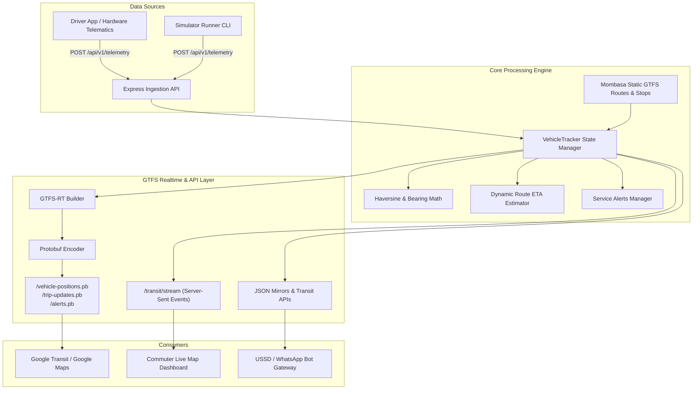

# Architecture — Mat-Pulse

How **Mat-Pulse** is engineered.

**Last reviewed:** 2026-10-04 by @jkose002

## Overview

Mat-Pulse is a real-time transit telemetry ingestion engine and GTFS / GTFS-Realtime (GTFS-RT) provider tailored for the Mombasa public transit (matatu) ecosystem.

It ingests real-time GPS telemetry from vehicle crew smartphones, NTSA speed governors, or telematics hardware, matches vehicles to coastal transit corridors, computes dynamic arrival countdowns (ETAs) for upcoming stages, and exports feeds formatted for both Google Maps (Protobuf) and commuter frontends (SSE/JSON).

## System Diagram

## Module Map

| Path | Responsibility | Notes |
| :--- | :--- | :--- |
| `src/models/types.ts` | Data models & schemas | Telemetry, vehicle states, ETAs, alerts |
| `src/gtfs/static/` | Static GTFS data & generator | Mombasa routes (`mombasa-routes.json`), CSV generator |
| `src/gtfs/realtime.ts` | GTFS-RT Protobuf serialization | Uses `gtfs-realtime-bindings` to generate v2.0 feeds |
| `src/engine/geo.ts` | Geographic calculations | Haversine distance, compass bearing |
| `src/engine/eta.ts` | Arrival prediction | Stage projection, travel time calculation |
| `src/engine/tracker.ts` | In-memory vehicle state store | Real-time state, stale vehicle pruning, event emitter |
| `src/routes/` | HTTP REST endpoints | Telemetry ingestion, GTFS-RT feeds, transit info |
| `src/simulator/` | Telemetry simulator | Standalone runner for testing without hardware |
| `src/public/` | Commuter web dashboard | HTML5, Tailwind CSS, Leaflet map with dark theme |
| `tests/` | Automated test suite | Vitest unit and integration test coverage |

## Data Flow

1. **Ingestion:** Vehicle submits a telemetry ping via `POST /api/v1/telemetry` containing `vehicleId`, `routeId`, `latitude`, `longitude`, and `speedKmh`.
2. **Validation:** Ingestion route validates coordinates against Mombasa coastal transit bounding box.
3. **Tracking & Map-Matching:** `VehicleTracker` finds the matching route, verifies previous position to compute bearing if missing, and calculates stage progression.
4. **ETA Calculation:** `calculateRouteEtas` evaluates remaining stages along the corridor and calculates countdown seconds based on effective vehicle speed.
5. **Feed Generation & Broadcast:**
   - Event emitted to connected web clients via `/api/v1/transit/stream` (SSE).
   - GTFS-RT feed endpoints dynamically serialize current active vehicles to Protocol Buffer binary format for Google Transit consumers.

## Constraints That Shape The Design

* **Low-end Android devices on 3G:** Commuter frontend is zero-build vanilla JS + Leaflet + Tailwind CDN, ensuring ultra-fast load times.
* **Informal Dispatch Headways:** Instead of strict timetable adherence, matatus operate dynamically; feeds support frequency-based trips and live delay adjustments.
* **Open Transit Standards:** 100% compliance with MobilityData GTFS Schedule and GTFS-Realtime v2.0 specifications.
